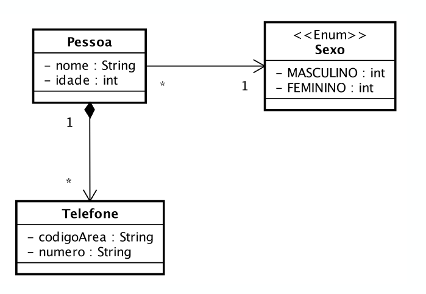

# ☕ Sistema de Cadastro de Pessoas (CLI)

Um sistema robusto de gerenciamento de cadastros via console (CLI), desenvolvido em Java.

Este projeto começou como uma atividade acadêmica (UNITINS) para praticar **POO e Collections**, mas foi expandido para demonstrar conceitos de **Arquitetura de Software**, **Código Defensivo** e a evolução da linguagem Java (Legacy vs. Modern).

---

## 🎨 Modelagem do Projeto (UML)

O projeto foi estruturado com base no seguinte diagrama de classes, respeitando relacionamentos de composição e contratos de interface:


*(Certifique-se de que a imagem `uml-projeto-cadastro.png` esteja na raiz do repositório)*

---

## 🚀 Funcionalidades e Destaques Técnicos

O sistema vai além de um CRUD simples, implementando validações de regra de negócio e tratamento de erros.

### 1. Gestão de Dados (CRUD & Validações)
* **Cadastro Blindado:** O método `Pessoa.lerDados()` implementa o padrão de "Loops de Validação". O sistema não quebra se o usuário digitar letras em campos numéricos (tratamento de `InputMismatchException` com `try-catch`).
* **Prevenção de Duplicatas:** Utilização de `equals()` e `hashCode()` (baseados no CPF) para impedir, via `List.contains()`, o cadastro de pessoas repetidas.
* **Exclusão Segura:** Lógica de exclusão (`case 4`) que localiza o objeto antes de remover, evitando erros de concorrência e falhas de índice.

### 2. Organização e Arquitetura
O código segue o princípio de **Separação de Responsabilidades**, organizado em pacotes:
* **`app`:** Contém o `Main.java`, responsável apenas pelo fluxo do menu e interação com o usuário.
* **`model`:** Contém as entidades (`Pessoa`, `Telefone`, `Sexo`), focadas em dados e comportamento interno.
* **`interfaces`:** Contém contratos (`Impressao.java`) para padronizar saídas.

### 3. POO Avançada
* **Composição:** A classe `Pessoa` gerencia o ciclo de vida de sua lista de telefones (a lista é instanciada no construtor), demonstrando forte acoplamento (Composição).
* **Enums Ricos:** O Enum `Sexo` não é apenas uma constante; ele possui atributos (ID, Nome Formatado) e métodos estáticos de busca (`selecionarSexo`), encapsulando a lógica de escolha.

### 4. Java: O Antigo vs. O Novo
O menu de opções demonstra explicitamente a evolução da sintaxe Java para ordenação de listas:
* **Opções 5-7:** Ordenação usando **Classes Anônimas** (`new Comparator<Pessoa>() { ... }`).
* **Opções 8-10:** Ordenação usando **Expressões Lambda e Streams** (`(p1, p2) -> ...`), demonstrando um código mais limpo e funcional.

---

## 🛠️ Como Executar o Projeto

### Pré-requisitos
* Java JDK 11 ou superior.
* Uma IDE (Eclipse, IntelliJ, VS Code) ou Terminal.

### Passo a Passo
1.  Clone este repositório:
    ```bash
    git clone [https://github.com/paulo-hdourado/sistema-cadastro-pessoas-cli.git](https://github.com/paulo-hdourado/sistema-cadastro-pessoas-cli.git)
    ```
2.  Importe o projeto na sua IDE como um "Java Project".
3.  Localize a classe principal em `src/io/github/paulohdourado/cadastro/app/Main.java`.
4.  Execute a aplicação.

---

## 👤 Autor

**Paulo Dourado**
* [LinkedIn](https://www.linkedin.com/in/paulo-hdourado)
* [GitHub](https://github.com/paulo-hdourado)

---